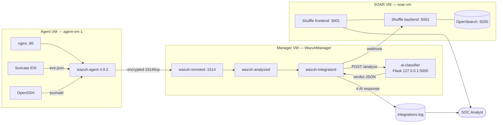

# Reducing SOC False Alarms through a Human-AI Collaboration Model

Final Project — Security Operations Center (SOC), Genap 2024/2025.

A working SOC pipeline on Azure that pairs a Wazuh detection stack with a self-trained
machine-learning classifier and a SOAR platform. Every alert Wazuh raises is scored by a
locally hosted model that predicts whether the alert is a false positive. The verdict is
written back into the Wazuh log stream so a human analyst keeps the final say, and the SOAR
platform continues to receive alerts independently so response capability is never gated on
the model being right.

No third-party AI API is used. The model is trained, serialized, and served entirely on our
own infrastructure, as required by the project specification.

---

## Table of contents

| Document | Contents |
|---|---|
| [docs/01-architecture.md](docs/01-architecture.md) | Hosts, network layout, data flow, component versions |
| [docs/02-ai-model.md](docs/02-ai-model.md) | Feature engineering, training, serialization, serving |
| [docs/03-integration.md](docs/03-integration.md) | Wazuh integrator contract, wrapper script, SOAR webhook |
| [docs/04-benchmarks.md](docs/04-benchmarks.md) | Metrics used, how they were computed, raw numbers |
| [docs/05-results-analysis.md](docs/05-results-analysis.md) | What the numbers actually mean, including a label-leakage finding |
| [docs/06-troubleshooting.md](docs/06-troubleshooting.md) | The integration outage we hit, root cause, fix, verification |

---

## Repository layout

```
.
├── ai-classifier/           Flask inference service deployed on the Wazuh Manager
│   ├── app.py               /analyze and /health endpoints
│   ├── model_config.json    Decision threshold and feature order
│   ├── requirements.txt     Pinned Python dependencies
│   └── ai-classifier.service systemd unit
├── config/
│   ├── manager/             Wazuh Manager ossec.conf, local rules, local decoders
│   ├── agent/               Wazuh Agent ossec.conf (Suricata + nginx + journald)
│   └── soar/                Shuffle docker-compose.yml
├── data/
│   ├── wazuh_real_flat.csv  738 real alerts exported from Wazuh, hand-labeled
│   └── README.md            Schema and labeling criteria
├── docs/                    Final report, split by topic
│   └── diagrams/            Mermaid architecture diagrams
├── integration/
│   ├── custom-ai            Wazuh integrator wrapper (current, working)
│   ├── custom-ai.broken.sh  The original broken wrapper, kept for the write-up
│   └── custom-ai.py         Integration logic: read alert, POST to model, log verdict
├── notebooks/
│   └── labellingFalsePositive.ipynb  Dataset construction and model training
└── scripts/
    ├── deploy-integration.sh  Install the wrapper and restart the manager
    ├── test-integration.sh    Four-layer verification
    └── trigger-attacks.sh     Generate alerts for an end-to-end test
```

---

## Architecture at a glance



Full diagram set and a per-hop description: [docs/01-architecture.md](docs/01-architecture.md).

---

## Component versions

| Component | Version | Host |
|---|---|---|
| Wazuh Manager | v4.9.2 (rev 40921) | Manager VM |
| Wazuh Agent | v4.9.2 (rev 40921) | Agent VM |
| OS (all three VMs) | Ubuntu 24.04.4 LTS | Azure |
| Shuffle SOAR | backend/frontend `latest`, workers, orborus | SOAR VM |
| OpenSearch | 3.2.0 | SOAR VM |
| Flask | 3.1.3 | Manager VM |
| scikit-learn (serving) | 1.9.1 | Manager VM |
| scikit-learn (training) | 1.6.1 | Colab |

The scikit-learn version gap between training and serving is a known defect. See
[docs/05-results-analysis.md](docs/05-results-analysis.md).

---

## Quick start

These steps assume three Ubuntu 24.04 VMs on an Azure virtual network, with the Wazuh Manager
and Agent already enrolled.

```bash
# 1. Deploy the inference service on the Manager VM
sudo mkdir -p /opt/ai-classifier
sudo cp ai-classifier/app.py ai-classifier/model_config.json /opt/ai-classifier/
sudo cp <your-trained-artifacts>/*.pkl /opt/ai-classifier/
python3 -m venv ~/myenv && ~/myenv/bin/pip install -r ai-classifier/requirements.txt
sudo cp ai-classifier/ai-classifier.service /etc/systemd/system/
sudo systemctl daemon-reload && sudo systemctl enable --now ai-classifier

# 2. Install the Wazuh integration
sudo bash scripts/deploy-integration.sh

# 3. Verify
sudo bash scripts/test-integration.sh
```

The `<integration>` blocks in `config/manager/ossec.conf` must be present before step 3. The
hook URL and webhook ID are redacted in this repository; substitute your own.

---

## Honest summary of results

The infrastructure works. The model does not yet.

The alert pipeline is fully operational end to end: agent telemetry reaches the manager,
`wazuh-integratord` invokes the classifier for every alert at level 3 and above, the
classifier returns a verdict within the timeout, and the verdict is appended to
`/var/ossec/logs/integrations.log` for analyst review. The SOAR platform receives its own
copy of every alert at level 5 and above over a separate webhook, so incident response is not
blocked by the model.

The classifier's cross-validation scores were perfect — accuracy, weighted F1, and macro
recall all 1.0000 with a train/test gap of 0.0000. That is not a success. It is the signature
of label leakage: the labels were derived from `rule.id`, and `rule.id` was then given to the
model as an input feature, so the classifier only had to memorize a lookup table. Verified on
the real data, all 15 distinct `rule.id` values map to exactly one label each, with zero
mixed-label rules.

In production this manifests as a concrete safety problem: rule 5710 (`sshd: Attempt to login
using a non-existent user`) is labeled a true positive in our real dataset but is suppressed
by the deployed model with confidence 0.0, because the synthetic training set labeled it
benign. A real SSH reconnaissance attempt would be silently marked as a false alarm.

This is documented rather than hidden, because the project asks for analysis of results
obtained. The full breakdown, with reproduction steps and the corrective plan, is in
[docs/05-results-analysis.md](docs/05-results-analysis.md).

---

## Security notes for anyone cloning this

- All public IP addresses and the Shuffle webhook ID are replaced with placeholders. Prose and
  diagrams use `<MANAGER_IP>`, `<SOAR_IP>`, `<AGENT_IP>`. The XML config files use
  `SOAR_IP_PLACEHOLDER` and `REPLACE_WITH_YOUR_WEBHOOK_ID` instead, because angle brackets
  would make `ossec.conf` malformed XML and Wazuh would refuse to start.
- The agent's manager address `10.0.0.6` is left intact. It is a private RFC 1918 address on
  the Azure VNet and is not reachable externally.
- No credentials are committed. The Shuffle compose file reads its OpenSearch password from
  `${SHUFFLE_OPENSEARCH_PASSWORD}`, supplied via a `.env` file that is git-ignored.
- `data/wazuh_real_flat.csv` has its agent name column reduced to `xxx`. Review it before
  redistributing.
- Serialized models (`*.pkl`) are excluded from version control. `joblib.load` executes
  arbitrary code on untrusted input; distribute model artifacts through a channel where
  provenance is verifiable.
