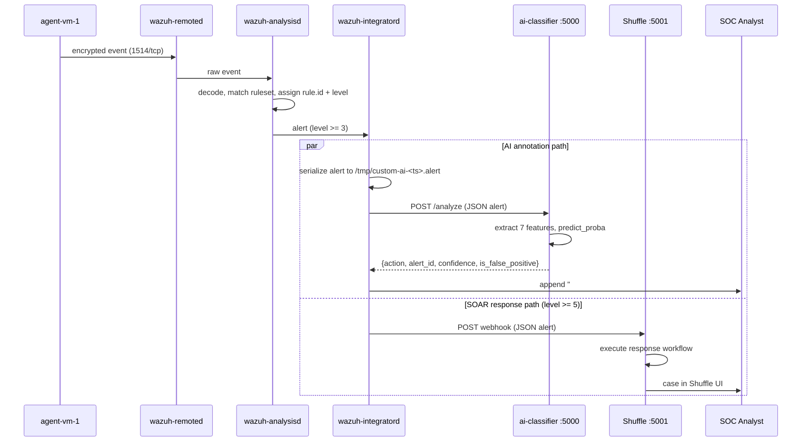

# 1. Implemented Architecture

## 1.1 Design goal

The project specification asks for a system that reduces false alarms *without compromising
detection accuracy*. Those two goals pull against each other, so the architecture resolves the
tension structurally rather than by tuning a single number.

The key decision: **the AI classifier is advisory, not authoritative.** It sits on a side
channel. It annotates alerts with a verdict, but it cannot delete an alert, cannot stop an
alert from reaching the SOAR platform, and cannot prevent an analyst from seeing it. Detection
recall is therefore unchanged by construction — the classifier can only add information, never
remove it.

This is what makes the system a *Human-AI collaboration* model rather than an automated
filter. The AI reduces the analyst's triage burden by pre-sorting, and the human retains veto
power over every suppression decision.

## 1.2 Physical topology

Three Azure free-tier student VMs, all Ubuntu 24.04.4 LTS, on a shared virtual network.

| Role | Hostname | Public address | Purpose |
|---|---|---|---|
| Detection | `WazuhManager` | `<MANAGER_IP>` | Wazuh Manager 4.9.2, AI classifier |
| Telemetry | `agent-vm-1` | `<AGENT_IP>` | Wazuh Agent 4.9.2, nginx, Suricata, OpenSSH |
| Response | `soar-vm` | `<SOAR_IP>` | Shuffle SOAR on Docker Swarm |

The agent reaches the manager over the **private** VNet address `10.0.0.6`, not the public IP.
Agent-to-manager traffic never leaves the Azure virtual network. This is visible in
`config/agent/ossec.conf`:

```xml
<client>
  <server>
    <address>10.0.0.6</address>
    <port>1514</port>
    <protocol>tcp</protocol>
  </server>
</client>
```

## 1.3 Listening ports

| Host | Port | Process | Exposure |
|---|---|---|---|
| Manager | 1514/tcp | `wazuh-remoted` | VNet — agent enrollment and event channel |
| Manager | 1515/tcp | `wazuh-authd` | VNet — agent registration |
| Manager | 55000/tcp | `wazuh-apid` | VNet — Wazuh REST API |
| Manager | 5000/tcp | `ai-classifier` (Flask) | **loopback only** (`127.0.0.1`) |
| Agent | 22/tcp | `sshd` | Public |
| Agent | 80/tcp | `nginx` | Public — the attack surface for web scenarios |
| SOAR | 5001/tcp | `shuffle-backend` | Public — webhook receiver |
| SOAR | 3001/tcp, 3443/tcp | `shuffle-frontend` | Public — analyst UI |
| SOAR | 9200/tcp | `shuffle-opensearch` | Public — workflow/event store |

The classifier binding to `127.0.0.1:5000` is deliberate. It is reachable only by
`wazuh-integratord` running on the same host, so the model is not an internet-facing service
and needs no authentication layer of its own.

## 1.4 Data flow



The two paths are independent. If the classifier is down, misconfigured, or returns garbage,
the SOAR path is unaffected and response capability is preserved. This is the property that
satisfies specification item 6 ("prove the architecture is still capable of responding
effectively to attacks") even while the model is imperfect.

## 1.5 Telemetry sources on the agent

Configured in `config/agent/ossec.conf`:

| Source | Format | Yields |
|---|---|---|
| `journald` | `journald` | sshd authentication events, systemd unit state |
| `/var/log/suricata/eve.json` | `json` | Network IDS alerts with `data.alert.signature_id` |
| `/var/log/audit/audit.log` | `audit` | Syscall and file-access auditing |
| `/var/log/dpkg.log` | `syslog` | Package installation — malware persistence signal |
| `/var/ossec/logs/active-responses.log` | `syslog` | Active-response feedback loop |

Suricata is the reason the feature set includes `data.alert.signature_id`. That field exists
on Suricata-sourced alerts but **not** on native Wazuh rule alerts such as sshd events. The
consequences are analyzed in [05-results-analysis.md](05-results-analysis.md).

## 1.6 Ruleset state

`config/manager/local_rules.xml` and `config/manager/local_decoder.xml` are the stock Wazuh
4.9.2 templates. The only local rule present is the shipped example, rule `100001`, which
matches `sshd` authentication failures from the literal placeholder address `1.1.1.1`:

```xml
<rule id="100001" level="5">
  <if_sid>5716</if_sid>
  <srcip>1.1.1.1</srcip>
  <description>sshd: authentication failed from IP 1.1.1.1.</description>
</rule>
```

This is a **known gap**. The training notebook assumes custom rules exist in the `100001`–
`100204` range with descriptions such as `CUSTOM Possible TCP SYN Flood` and
`CUSTOM TEST TCP SYN`. Those rules were never written to the manager, so alerts carrying those
IDs are synthetic only and never occur in production. Tracked in
[05-results-analysis.md](05-results-analysis.md#gap-3-custom-rules-exist-only-in-the-training-set).

## 1.7 Attack scenarios covered

Per specification item 3, scenarios are drawn from DDoS, malware, and social engineering.

| Scenario | Generator | Detection path | Representative rules |
|---|---|---|---|
| SSH brute force / credential stuffing | repeated failed logins against `<AGENT_IP>` | journald → sshd decoder | 5710, 5712, 5713, 5716, 5503 |
| Port scanning and recon | `nmap` against the agent | Suricata → eve.json | 2000537, 2001219, 2001220 |
| Web exploitation | HTTP requests against nginx | nginx access log + Suricata | 31101, 31103, 31104, 2024364 |
| Volumetric / SYN flood | packet generator against the agent | Suricata + connection rate | 2010001-class signatures |
| Persistence after compromise | crontab modification, package install | audit.log, dpkg.log | 2833, 2902–2905 |

`scripts/trigger-attacks.sh` reproduces the SSH path, which is the one used for the end-to-end
verification recorded in [06-troubleshooting.md](06-troubleshooting.md).
