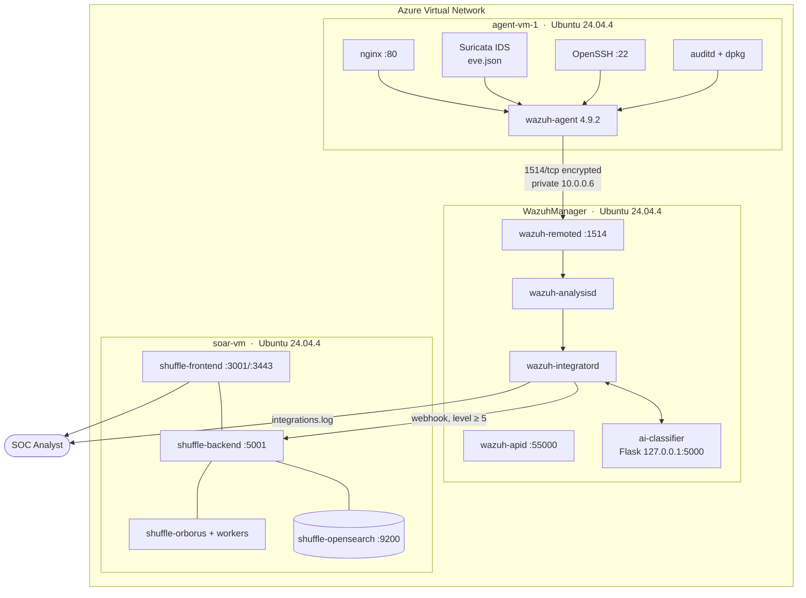
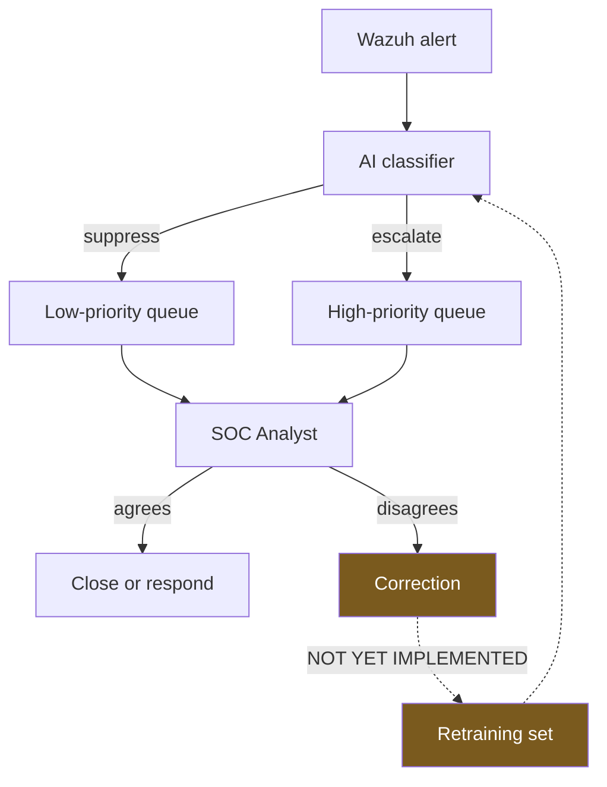

# Architecture Diagrams

Mermaid source for the diagrams referenced in the report. GitHub renders these natively.

## D1 — Deployment topology



## D2 — Alert lifecycle

```mermaid
sequenceDiagram
    autonumber
    participant AG as agent-vm-1
    participant AN as wazuh-analysisd
    participant IN as wazuh-integratord
    participant AI as ai-classifier
    participant SH as Shuffle SOAR
    participant AS as Analyst

    AG->>AN: event (1514/tcp)
    AN->>AN: decode → match rule → assign id + level

    alt level >= 3
        AN->>IN: dispatch to custom-ai
        IN->>IN: write /tmp/custom-ai-<ts>.alert
        IN->>AI: POST /analyze
        AI->>AI: 7 features → predict_proba
        AI-->>IN: {action, confidence, is_false_positive}
        IN->>AS: "# AI response: ..." in integrations.log
    end

    alt level >= 5
        AN->>IN: dispatch to shuffle
        IN->>SH: POST webhook
        SH->>SH: run response workflow
        SH->>AS: case in Shuffle UI
    end

    Note over AS: Analyst decides.<br/>The model advises; it never suppresses.
```

## D3 — Model decision path

```mermaid
flowchart LR
    A["Alert JSON"] --> B{"timestamp<br/>parseable?"}
    B -->|yes| C["hour, day_of_week, is_weekend"]
    B -->|no| D["0, 0, 0"]
    C --> E
    D --> E

    E["rule.level<br/>data.alert.severity"] --> F{"rule.id known<br/>to encoder?"}
    F -->|yes| G["le_id.transform"]
    F -->|no| H["0 &nbsp;— silent fallback"]
    G --> I
    H --> I

    I{"signature_id known?"} -->|yes| J["le_sig.transform"]
    I -->|no| K["0 &nbsp;— silent fallback"]
    J --> L
    K --> L

    L["feature vector, 7 dims"] --> M["RandomForest<br/>predict_proba"]
    M --> N{"proba < 0.491?"}
    N -->|yes| O["suppress<br/>is_false_positive: true"]
    N -->|no| P["escalate<br/>is_false_positive: false"]

    style H fill:#8b2f2f,color:#fff
    style K fill:#8b2f2f,color:#fff
```



The two red nodes are the silent-fallback defect described in
[../05-results-analysis.md](../05-results-analysis.md#53-gap-2-silent-encoder-fallback).
Native Wazuh alerts have no `data.alert.signature_id`, so they always take the right-hand
branch and are scored against an unrelated Suricata signature.

## D4 — Human-AI collaboration loop



Both queues reach the analyst — the model reorders work, it does not discard it. That is what
preserves detection recall regardless of model quality.

The dashed feedback path is the missing piece. Without it the model cannot improve, and the
labels stay derived from rule IDs rather than from observed analyst judgment. It is item 10 in
the remediation list.
